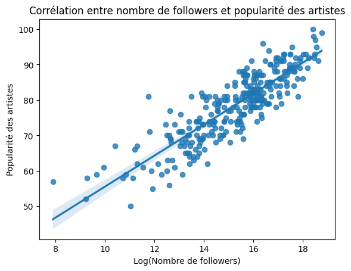

# Spotify Playlist Analytics

    

Un notebook d'analyse exploratoire de cinq playlists **Top Hits of 2020–2024** publiées par Spotify. Il montre le chemin des données, de l'API aux graphiques.

**Dans le notebook**

- Extraction des titres et des artistes avec Spotipy, puis récupération des artistes par lots.
- Création, dédoublonnage et jointure de tables avec pandas.
- Analyse de la popularité des artistes, de la présence des genres dans les playlists et des mots fréquents dans les titres.



*Exemple de visualisation enregistré lors de l'analyse de 2025.*

## Reproduire l'analyse

```bash
python -m pip install -r requirements.txt
cp .env.example .env
```

Renseignez vos identifiants Spotify dans `.env`, enregistrez la même URI de redirection dans votre [application Spotify](https://developer.spotify.com/dashboard), puis ouvrez [`main.ipynb`](main.ipynb) dans JupyterLab ou VS Code.

Le notebook utilise les premiers titres renvoyés pour chaque playlist. Les résultats décrivent cet échantillon de playlists, pas les écoutes de l'ensemble des utilisateurs Spotify.
